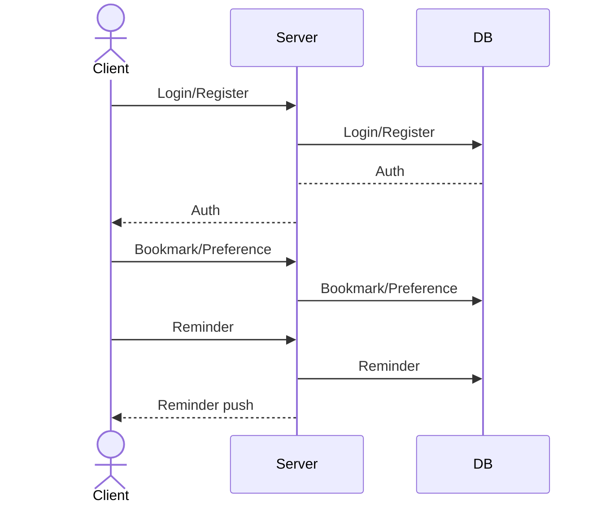

# Your startup name here

[My Notes](notes.md)

A brief description of the application here. Lorem ipsum dolor sit amet, consectetur adipiscing elit, sed do eiusmod tempor incididunt ut labore et dolore magna aliqua. Ut enim ad minim veniam, quis nostrud exercitation ullamco laboris nisi ut aliquip ex ea commodo consequat. Duis aute irure dolor in reprehenderit in voluptate velit esse cillum dolore eu fugiat nulla pariatur. Excepteur sint occaecat cupidatat non proident, sunt in culpa qui officia deserunt mollit anim id est laborum.

> [!NOTE]
>  This is a template for your startup application. You must modify this `README.md` file for each phase of your development. You only need to fill in the section for each deliverable when that deliverable is submitted in Canvas. Without completing the section for a deliverable, the TA will not know what to look for when grading your submission. Feel free to add additional information to each deliverable description, but make sure you at least have the list of rubric items and a description of what you did for each item.

> [!NOTE]
>  If you are not familiar with Markdown then you should review the [documentation](https://docs.github.com/en/get-started/writing-on-github/getting-started-with-writing-and-formatting-on-github/basic-writing-and-formatting-syntax) before continuing.

## 🚀 Specification Deliverable

> [!NOTE]
>  Fill in this sections as the submission artifact for this deliverable. You can refer to this [example](https://github.com/webprogramming260/startup-example/blob/main/README.md) for inspiration.

For this deliverable I did the following. I checked the box `[x]` and added a description for things I completed.

- [x] Proper use of Markdown
- [x] A concise and compelling elevator pitch
- [x] Description of key features
- [x] Description of how you will use each technology
- [x] One or more rough sketches of your application. Images must be embedded in this file using Markdown image references.

### Elevator pitch

I have friends and family scattered from Japan to Germany and keeping track of everyone’s local time is a frequent hassle. I often find myself Googling “current time in Tokyo” or manually calculating when our schedules overlap so that we can call each other.

ezTime is a simple, single-page tool designed to help myself and others save some time and headache. It lets me quickly check the current or future time in the time zones I care about most with as little friction as possible. If it isn’t simpler than mental math and Google searches, it isn’t worth using, so ezTime is designed with a focus on clarity and usability with minimal input. Beyond login and registration, there is no navigation and everything happens on one page, including bookmarked time zones, quick time conversion, and unobtrusive reminder notifications.

### Design

Here is a simple diagram to illustrate how visitors interact with the backend.

### Key features

- **Bookmarked Time Zones:** Users can save frequently checked time zones (e.g., “Mom”, "Tokyo Friends”) for quick, always-visible reference. These appear in a scrollable sidebar.
- **Central Time Conversion Widget:** At the center of the page is a simple widget for entering a different time. Once a custom time has been provided, the bookmarked time zones temporarily update to display the corresponding times for each person.
- **Reminders Sidebar:** Users can create reminders which are stored on the server and delivered via WebSocket push notification at the scheduled time.
- **Import/Export:** Reminders and bookmarks can be exported or imported as a text string stored in the clipboard for ease of sharing.

### Technologies

I am going to use the required technologies in the following ways.

- **HTML** - Used to structure the splash+login page and the home page with all core containers.
- **CSS** - Responsive and intuitive layout. Scrollable sidebar regions. Clean, dark UI.
- **React** - Routing between pages. Components for bookmark tiles, reminder tiles, and preference controls. Dynamic updates when entering custom times. Sidebar rendering + smooth UI state transitions. Popup dialogs for creating new bookmarks and reminders.
- **Service** - Registration and authentication. Bookmark and Reminder CRUD. Update user preferences. Display an inspirational quote from a third party API on login or refresh.
- **DB/Login** - The database will store user account credentials, preferences, and their bookmarked timezones and reminders, including organizational metadata.
- **WebSocket** - Used to push real-time reminder notifications from the server to the client.
When a reminder’s time is reached, the server sends a WebSocket message, prompting a notification popup on the client.

## 🚀 AWS deliverable

For this deliverable I did the following. I checked the box `[x]` and added a description for things I completed.

- [x] **Server deployed and accessible with custom domain name** - [My server link](https://eztimes.me).

My domain registrar is namecheap, but AWS Route 53's Hosted Zone is the actual nameserver.

Caddy is a reverse proxy service that actually receives incoming requests and forwards them to appropriate services. Needs to be restarted to update. Read more [here](https://github.com/webprogramming260/.github/blob/main/profile/webServers/caddy/caddy.md).

## 🚀 HTML deliverable

For this deliverable I did the following. I checked the box `[x]` and added a description for things I completed.

- [x] **HTML pages** - I created the two HTML pages necessary for my service: the splash/login page and the dashboard.
- [x] **Proper HTML element usage** - My HTML pages appropriately use HTML tags, including each of BODY, NAV, MAIN, HEADER, FOOTER where appropriate.
- [x] **Links** - My website does not feature navigation beyond redirecting after authorization or logout, but for the time being I have implemented buttons to navigate between the two pages without authorization.
- [x] **Text** - I added text placeholders for instructions, reminder/bookmark element data, and site info.
- [x] **3rd party API placeholder** - I added my 3rd party quote API placeholder.
- [x] **Images** - I've added a sample image of the Earth as seen from space. Given the point of the website is to resolve timezone issues, it seemed thematic. I might use something similar as a background to the splash screen.
- [x] **Login placeholder** - I completed my login and registration placeholders on the splash page.
- [x] **DB data placeholder** - DB Data is represented by the placeholder reminder/bookmark elements.
- [x] **WebSocket placeholder** - I added a to-do for the websocket, which will provide the push-notification functionality for reminders, which 

## 🚀 CSS deliverable

For this deliverable I did the following. I checked the box `[x]` and added a description for things I completed.

- [ ] **Header, footer, and main content body** - I did not complete this part of the deliverable.
- [ ] **Navigation elements** - I did not complete this part of the deliverable.
- [ ] **Responsive to window resizing** - I did not complete this part of the deliverable.
- [ ] **Application elements** - I did not complete this part of the deliverable.
- [ ] **Application text content** - I did not complete this part of the deliverable.
- [ ] **Application images** - I did not complete this part of the deliverable.

## 🚀 React part 1: Routing deliverable

For this deliverable I did the following. I checked the box `[x]` and added a description for things I completed.

- [ ] **Bundled using Vite** - I did not complete this part of the deliverable.
- [ ] **Components** - I did not complete this part of the deliverable.
- [ ] **Router** - I did not complete this part of the deliverable.

## 🚀 React part 2: Reactivity deliverable

For this deliverable I did the following. I checked the box `[x]` and added a description for things I completed.

- [ ] **All functionality implemented or mocked out** - I did not complete this part of the deliverable.
- [ ] **Hooks** - I did not complete this part of the deliverable.

## 🚀 Service deliverable

For this deliverable I did the following. I checked the box `[x]` and added a description for things I completed.

- [ ] **Node.js/Express HTTP service** - I did not complete this part of the deliverable.
- [ ] **Static middleware for frontend** - I did not complete this part of the deliverable.
- [ ] **Calls to third party endpoints** - I did not complete this part of the deliverable.
- [ ] **Backend service endpoints** - I did not complete this part of the deliverable.
- [ ] **Frontend calls service endpoints** - I did not complete this part of the deliverable.
- [ ] **Supports registration, login, logout, and restricted endpoint** - I did not complete this part of the deliverable.

## 🚀 DB deliverable

For this deliverable I did the following. I checked the box `[x]` and added a description for things I completed.

- [ ] **Stores data in MongoDB** - I did not complete this part of the deliverable.
- [ ] **Stores credentials in MongoDB** - I did not complete this part of the deliverable.

## 🚀 WebSocket deliverable

For this deliverable I did the following. I checked the box `[x]` and added a description for things I completed.

- [ ] **Backend listens for WebSocket connection** - I did not complete this part of the deliverable.
- [ ] **Frontend makes WebSocket connection** - I did not complete this part of the deliverable.
- [ ] **Data sent over WebSocket connection** - I did not complete this part of the deliverable.
- [ ] **WebSocket data displayed** - I did not complete this part of the deliverable.
- [ ] **Application is fully functional** - I did not complete this part of the deliverable.
